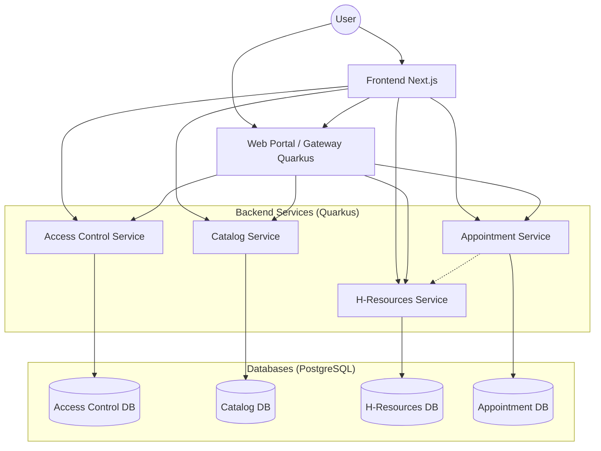

# Citas Microservices System

A comprehensive microservices architecture for managing appointments, built with Quarkus and Next.js.

## Overview

The **Citas Microservices System** is designed to handle the complex requirements of scheduling and managing appointments ("citas") in an organizational context. It separates concerns into distinct microservices, allowing for independent scaling, development, and maintenance.

### System Architecture



## Modules

| Module | Description | Tech Stack |
|--------|-------------|------------|
| [**access-control-service**](./access-control-service/README.md) | Manages authentication, user accounts, and role-based access control (Admin, Client, Employee). | Quarkus, PostgreSQL |
| [**appointment-service**](./appointment-service/README.md) | Core logic for scheduling appointments, managing availability, and booking rules. | Quarkus, PostgreSQL |
| [**catalog-service**](./catalog-service/README.md) | Manages the catalog of services ("Tramites") and their requirements. | Quarkus, PostgreSQL |
| [**hresources-service**](./hresources-service/README.md) | HR system for managing employees, schedules, and work shifts. | Quarkus, PostGIS, PostgreSQL |
| [**web-portal**](./web-portal/README.md) | Aggregator service and server-side rendered portal (Gateway). | Quarkus, Qute |
| [**frontend**](./frontend/README.md) | Modern responsive user interface for clients and admins. | Next.js, React, Tailwind |

## Prerequisites

- **Java**: JDK 21+
- **Docker**: For running databases and services in containers.
- **Node.js**: v18+ (for Frontend development)
- **Maven**: For building Java services (bundled `mvnw` is included).

## Quick Start

The easiest way to run the entire system is using Docker Compose.

1.  **Clone the repository**
2.  **Start the infrastructure**
    ```bash
    docker compose up -d
    ```
    This will start all databases (PostgreSQL) and the microservices.

3.  **Access the applications**
    - **Frontend**: [http://localhost:3000](http://localhost:3000)
    - **Web Portal**: [http://localhost:8080](http://localhost:8080)
    - **Access Control API**: [http://localhost:8081](http://localhost:8081)
    - **Catalog API**: [http://localhost:8082](http://localhost:8082)
    - **HR Service API**: [http://localhost:8083](http://localhost:8083)
    - **Appointment API**: [http://localhost:8084](http://localhost:8084/q/swagger-ui)

## Development

To run services individually in development mode (with live reload):

### Backend Services (Quarkus)
Navigate to the service directory and run:
```bash
./mvnw quarkus:dev
```

### Frontend (Next.js)
Navigate to the `frontend` directory and run:
```bash
npm install
npm run dev
```

## Documentation
Each module has its own detailed `README.md` file. Please refer to them for specific configuration details and API usage.
